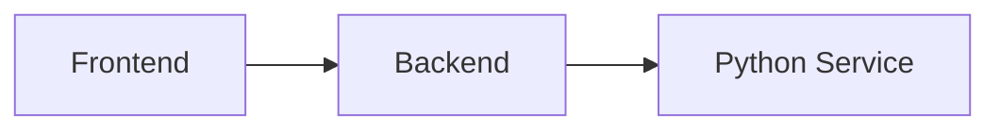

# Documentation Style Guide

**Version:** 1.0  
**Purpose:** Define consistent formatting, terminology, and structure standards for all Whisperrr documentation

---

## Table of Contents

1. [Markdown Formatting Standards](#markdown-formatting-standards)
2. [Terminology and Voice](#terminology-and-voice)
3. [Required Sections](#required-sections)
4. [Cross-References](#cross-references)
5. [Code Examples](#code-examples)
6. [Diagrams and Visuals](#diagrams-and-visuals)
7. [File Structure](#file-structure)

---

## Markdown Formatting Standards

### Heading Levels

Use heading levels consistently to create a clear hierarchy:

```markdown
# Document Title (H1 - only one per document)

## Major Section (H2 - main sections)

### Subsection (H3 - subsections within major sections)

#### Minor Subsection (H4 - rarely used, for very detailed breakdowns)
```

**Rules:**
- ✅ Always start with H1 (#) for document title
- ✅ Use H2 (##) for main sections
- ✅ Use H3 (###) for subsections
- ✅ Don't skip heading levels (e.g., don't go from H2 to H4)
- ✅ Use consistent heading capitalization (Title Case)

### Code Blocks

#### Inline Code
Use backticks for inline code, file names, and technical terms:

```markdown
The `AudioController.java` file handles API endpoints.
Set the `MODEL_SIZE` environment variable to `large`.
```

#### Code Blocks
Use fenced code blocks with language identifiers:

```markdown
```java
public class AudioController {
    // Code here
}
```

```typescript
const transcribeAudio = async (file: File) => {
    // Code here
};
```

```bash
docker compose up -d
```
```

**Rules:**
- ✅ Always specify language for syntax highlighting
- ✅ Use appropriate language identifier (java, typescript, bash, python, etc.)
- ✅ Include necessary context in code examples
- ✅ Add comments to explain complex code

### Lists

#### Unordered Lists
Use for items without specific order:

```markdown
- First item
- Second item
  - Nested item
  - Another nested item
- Third item
```

#### Ordered Lists
Use for sequential steps or prioritized items:

```markdown
1. First step
2. Second step
3. Third step
```

**Rules:**
- ✅ Use consistent bullet style (dash `-` for unordered)
- ✅ Indent nested lists with 2 spaces
- ✅ End list items with periods if they're sentences

### Emphasis

```markdown
**Bold** - Use for important terms, file names in prose, or emphasis
*Italic* - Use for emphasis or technical terms on first mention
`Code` - Use for code, file paths, commands, variables
```

### Tables

Use tables for structured data:

```markdown
| Column 1 | Column 2 | Column 3 |
|----------|----------|----------|
| Value 1  | Value 2  | Value 3  |
| Value 4  | Value 5  | Value 6  |
```

**Rules:**
- ✅ Align columns consistently
- ✅ Use header row
- ✅ Keep tables simple and readable

### Horizontal Rules

Use `---` to separate major sections:

```markdown
## Section 1

Content here

---

## Section 2

Content here
```

---

## Terminology and Voice

### Voice and Tone

- **Use active voice:** "The service processes files" not "Files are processed by the service"
- **Be direct and clear:** Avoid unnecessary words
- **Be consistent:** Use the same terms throughout
- **Be helpful:** Write for the reader's benefit

### Technical Terms

#### Standard Terminology

| Term | Usage | Example |
|------|-------|---------|
| Whisperrr | Project name, always capitalized | "Whisperrr is a transcription platform" |
| backend | Service name, lowercase | "The backend service handles validation" |
| frontend | Service name, lowercase | "The frontend displays results" |
| Python service | Service name, capitalize Python | "The Python service processes audio" |
| Faster Whisper | Library name, capitalize both words | "Faster Whisper provides transcription" |

#### Service References

- **Frontend:** React Frontend, Frontend Service, or just "frontend"
- **Backend:** Spring Boot API, Backend API, or just "backend"
- **Python Service:** Python Service, FastAPI Service, or "Python service"

#### Code References

- **File names:** Use backticks and include extension: `AudioController.java`
- **Class/Function names:** Use backticks: `transcribeAudio()`
- **Variables:** Use backticks: `MODEL_SIZE`
- **Paths:** Use backticks: `backend/src/main/java/`

### Consistent Phrases

- ✅ "See [document] for details" (not "refer to" or "check")
- ✅ "For more information, see [link]" (not "for more info")
- ✅ "Note:" for important information (not "NB:" or "Important:")
- ✅ "Example:" for code examples (not "e.g." in technical contexts)

---

## Required Sections

### Document Header

Every document should start with:

```markdown
# Document Title

**Purpose:** Brief one-sentence purpose  
**Audience:** Target audience  
**Last Updated:** Date (YYYY-MM-DD)  
**Related Docs:** Links to related documentation

---
```

### Table of Contents

For documents longer than 3 sections, include a table of contents:

```markdown
## Table of Contents

1. [Section 1](#section-1)
2. [Section 2](#section-2)
3. [Section 3](#section-3)
```

### Standard Sections

#### Getting Started Documents
- Overview
- Prerequisites
- Installation Steps
- Verification
- Next Steps
- See Also

#### Architecture Documents
- Overview
- System Architecture
- Component Details
- Data Flow
- Technology Stack
- See Also

#### Configuration Documents
- Overview
- Configuration Files
- Environment Variables
- Examples
- Best Practices
- Troubleshooting
- See Also

#### API Documents
- Overview
- Authentication
- Endpoints
- Request/Response Examples
- Error Handling
- Rate Limits
- See Also

### See Also Section

End every document with a "See Also" section:

```markdown
## See Also

- [Related Document 1](path/to/doc1.md)
- [Related Document 2](path/to/doc2.md)
- [Main Documentation Index](../README.md)
```

---

## Cross-References

### Internal Links

Use relative paths for documentation links:

```markdown
See [Architecture Overview](../architecture/ARCHITECTURE.md) for system design.
Refer to [Configuration Guide](../guides/CONFIGURATION.md) for setup.
```

**Rules:**
- ✅ Use relative paths from current document location
- ✅ Link to specific sections when relevant: `[Section Name](path/to/doc.md#section-name)`
- ✅ Use descriptive link text (not "click here")
- ✅ Verify links work

### External Links

For external resources:

```markdown
See the [Spring Boot Documentation](https://spring.io/projects/spring-boot) for details.
```

**Rules:**
- ✅ Use full URLs for external links
- ✅ Open external links in new tab (add `{:target="_blank"}` if supported)
- ✅ Verify external links periodically

### Code References

When referencing code:

```markdown
The `transcribeAudio()` method in `AudioServiceImpl.java` handles transcription.
See `backend/src/main/java/com/shangmin/whisperrr/service/impl/AudioServiceImpl.java`.
```

---

## Code Examples

### Formatting Rules

1. **Always include language identifier:**
   ```java
   // Java example
   ```

2. **Add context comments:**
   ```typescript
   // Import required dependencies
   import { TranscriptionService } from './services/transcription';
   
   // Call transcription service
   const result = await TranscriptionService.transcribeAudio(file);
   ```

3. **Show complete examples when possible:**
   ```bash
   # Start all services
   docker compose up -d
   
   # Check service status
   docker compose ps
   ```

4. **Include expected output for commands:**
   ```bash
   $ docker compose ps
   NAME                STATUS
   whisperrr-backend   Up 2 minutes
   whisperrr-frontend  Up 2 minutes
   ```

### File Paths in Examples

Always use the correct path format:

```markdown
**Backend:**
`backend/src/main/resources/application.properties`

**Frontend:**
`frontend/src/utils/constants.ts`

**Python Service:**
`python-service/app/config.py`
```

---

## Diagrams and Visuals

### ASCII Diagrams

Use ASCII art for simple diagrams:

```markdown
```
┌─────────────┐    ┌─────────────┐    ┌─────────────┐
│   Frontend  │───►│   Backend   │───►│   Python    │
│  (Port 3737)│    │  (Port 7331)│    │  (Port 5001)│
└─────────────┘    └─────────────┘    └─────────────┘
```
```

### Mermaid Diagrams

For complex diagrams, use Mermaid syntax (if supported):

```markdown

```

**Rules:**
- ✅ Keep diagrams simple and readable
- ✅ Use consistent symbols and formatting
- ✅ Include port numbers and service names
- ✅ Add captions when needed

---

## File Structure

### Standard Document Structure

```markdown
# Title

**Purpose:** ...  
**Audience:** ...  
**Last Updated:** YYYY-MM-DD

---

## Table of Contents
(if document is long)

---

## Overview
(Brief introduction)

---

## [Main Content Sections]
(Organized by topic)

---

## Examples
(If applicable)

---

## Troubleshooting
(If applicable)

---

## See Also
(Links to related docs)
```

### Section Organization

1. **Start with overview** - Give context
2. **Present main content** - Organized logically
3. **Include examples** - Show how to use
4. **Add troubleshooting** - Common issues
5. **End with references** - See Also section

---

## Special Formatting

### Warnings and Notes

```markdown
> **Note:** This is a note about something important.

> **Warning:** This is a warning about potential issues.

> **Important:** This is critical information.
```

### Status Indicators

Use consistent status indicators:

- ✅ **Implemented** - Feature is complete
- 🚧 **In Progress** - Currently being developed
- 📋 **Planned** - Planned for future
- ⚠️ **Deprecated** - No longer recommended
- ❌ **Removed** - No longer available

### Version Information

When documenting version-specific information:

```markdown
> **Version:** 1.0.0  
> **Last Updated:** 2024-01-15
```

---

## Checklist for New Documentation

Before publishing documentation, verify:

- [ ] Document has proper header with purpose and audience
- [ ] Table of contents included (if document is long)
- [ ] All headings follow hierarchy rules
- [ ] Code blocks have language identifiers
- [ ] All internal links work
- [ ] Terminology is consistent
- [ ] "See Also" section included
- [ ] Examples are complete and tested
- [ ] No broken links
- [ ] Consistent formatting throughout

---

## Examples

### Good Documentation Example

```markdown
# Configuration Guide

**Purpose:** Guide for configuring Whisperrr services  
**Audience:** Developers, DevOps  
**Last Updated:** 2024-01-15

---

## Overview

This guide explains how to configure all Whisperrr services...

## Configuration Files

### Backend Configuration

The backend configuration is located in `backend/src/main/resources/application.properties`:

```properties
server.port=7331
whisperrr.service.url=http://localhost:5001
```

See [Backend Configuration](../guides/CONFIGURATION.md#backend) for details.

## See Also

- [Architecture Overview](../architecture/ARCHITECTURE.md)
- [Deployment Guide](../guides/DEPLOYMENT.md)
```

### Bad Documentation Example

```markdown
# config

this is about config. see the files.

backend: application.properties
frontend: constants.ts

that's it!
```

**Issues:**
- No proper header
- Inconsistent formatting
- No structure
- Missing links
- Poor grammar

---

## Maintenance

- Review this style guide quarterly
- Update when new patterns emerge
- Ensure all contributors follow these standards
- Use linters/tools to enforce formatting where possible

---

## See Also

- [Documentation Structure](../DOCUMENTATION_STRUCTURE.md)
- [Maintenance Guidelines](MAINTENANCE.md)
- [Documentation Templates](../templates/)

